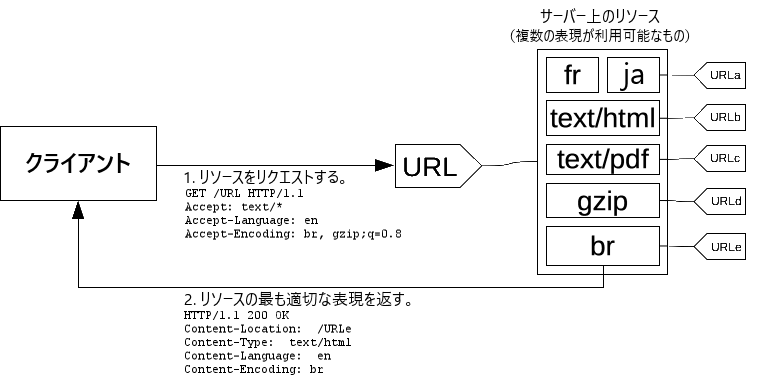

{{HTTPSidebar}}

[HTTP](/ja/docs/Glossary/HTTP) において**コンテンツ交渉** (content negotiation) は、同じ URI におけるさまざまな{{Glossary("Representation header","表現")}}のリソースを提供するために使用する仕組みであり、ユーザーエージェントはどのリソースがユーザーにもっとも適しているか (例えば文書の言語はどれか、画像形式はどれか、コンテンツエンコード方式はどれか) を指定することができます。

> **メモ:** [WHATWG のウィキページ](https://wiki.whatwg.org/wiki/Why_not_conneg)には、 HTTP コンテンツ交渉の短所がいくつか書かれています。 HTML5 では、コンテンツ交渉の代替として、例えば [`<source>` 要素](/ja/docs/Web/HTML/Element/source)を提供しています。

### コンテンツ交渉の原理

特定の文書は**リソース** (_resource_) と呼ばれます。クライアントがリソースを取得したいときは、 URL でリクエストします。サーバーはこの URL **表現** (_representation_) と呼ばれます–特定の表現をクライアントに返します。それぞれの表現を含むリソース全体が一つの特定の URL を持ちます。**コンテンツ交渉**は、リソースが呼び出されたときに特定の表現を選択する方法を定めます。クライアントサーバーの間で交渉する方法がいくつかあります。

最適な表現は、以下の 2 つの仕組みのいずれかによって識別されます。

- クライアントによる特定の [HTTP ヘッダー](/ja/docs/Web/HTTP/Headers) (**サーバー駆動型交渉**または **プロアクティブ交渉**)。これは、特定の種類のリソースで交渉を行う標準的な方法です。
- サーバーによる {{HTTPStatus("300")}} (Multiple Choices) または {{HTTPStatus("406")}} (Not Acceptable) [HTTP レスポンスコード](/ja/docs/Web/HTTP/Status) (**エージェント駆動型交渉** または **リアクティブ交渉**)。これはフォールバック機構として使用します。

数年来、[透過的コンテンツ交渉 (transparent content negotiation)](https://datatracker.ietf.org/doc/html/rfc2295) や `Alternates` ヘッダーといった他のコンテンツ交渉が提案されてきました。これらは支持を得られず、破棄されました。

## サーバー駆動型コンテンツ交渉

**サーバー駆動型コンテンツ交渉**またはプロアクティブコンテンツ交渉では、ブラウザー（または他の種類のユーザー エージェント）はいくつかの HTTP ヘッダーを URL と一緒に送信します。これらのヘッダーには、ユーザーが希望する選択肢を記述します。サーバーはこれらをヒントとして使い、内部アルゴリズムがクライアントに提供する最適なコンテンツを選択します。適切なリソースを提供できない場合、 {{HTTPStatus("406")}} (Not Acceptable) または {{HTTPStatus("415")}} (Unsupported Media Type) で応答し、対応しているメディアタイプのヘッダーを設定します（たとえば、POST と PATCH リクエストに対しては、それぞれ {{HTTPHeader("Accept-Post")}} または {{HTTPHeader("Accept-Patch")}} を使用します）。このアルゴリズムはサーバーに依存し、標準では定義されていません。 [Apache の交渉アルゴリズム](https://httpd.apache.org/docs/current/ja/content-negotiation.html#algorithm) をご覧ください。

HTTP/1.1 標準では、サーバー駆動型交渉を開始する標準ヘッダーの一覧 (例えば {{HTTPHeader("Accept")}}, {{HTTPHeader("Accept-Charset")}}, {{HTTPHeader("Accept-Encoding")}}, {{HTTPHeader("Accept-Language")}}) を定義しています。厳密に言えば {{HTTPHeader("User-Agent")}} はこの一覧に含まれていませんが、リクエストしたリソースの特定の表現を送信するために使用されることがあります。ただし、これはよい習慣ではないと考えられています。サーバーはどのヘッダーを実際にコンテンツ交渉で使用したかを示すために {{HTTPHeader("Vary")}} ヘッダー（あるいは、より的確な関係があるレスポンスヘッダー）を使用します。これにより、[キャッシュ](/ja/docs/Web/HTTP/Caching)が適切に機能します。

さらに、交渉に使用できるヘッダーを追加する実験的な提案があり、**クライアントヒント**と呼ばれています。クライアントヒントは、ユーザーエージェントを実行しているデバイスがどのようなものか（例えば、デスクトップコンピューターかモバイル端末か）を伝えます。

サーバー駆動型コンテンツ交渉は、リソースの特定の表現を決定するためのもっとも一般的な方法ですが、いくつか欠点があります。

- サーバーは、ブラウザーのことをすべて知っているわけではありません。クライアント拡張を加えても、ブラウザーの機能を完全には把握できません。クライアントが選択するリアクティブコンテンツ交渉とは異なり、サーバーの選択は常に少し独断的です。
- クライアントが提供する情報はかなり冗長であり（HTTP/2 のヘッダー圧縮は、この問題を緩和します）、またプライバシーのリスク（HTTP フィンガープリンティング）もあります。
- 指定されたリソースの複数の表現を送信すると、共有キャッシュの効率が下がります。また、サーバーの実装がより複雑になります。

### `Accept` ヘッダー

{{HTTPHeader("Accept")}} ヘッダーは、エージェントが処理することを望むメディアリソースの MIME タイプを羅列します。これはカンマ区切りの MIME タイプのリストで、それぞれの MIME タイプは、別の MIME タイプとの相対的な優先度を示す引数である品質係数と結びつけられています。

`Accept` ヘッダーは、ブラウザーまたは他のユーザーエージェントによって定義され、そのコンテキストによって変わることがあります。例えば、取得するものが HTML ページ、画像、動画、スクリプトなどに変わります。アドレスバーで指定した文書を取得するときと {{ HTMLElement("img") }}, {{ HTMLElement("video") }}, {{ HTMLElement("audio") }} 要素でリンクしたものを取得するときで異なります。ブラウザーはこのヘッダーで、最適と思われる値を自由に使用できます。[一般的なブラウザーの既定値](/ja/docs/Web/HTTP/Content_negotiation/List_of_default_Accept_values)の包括的な一覧があります。

### `Accept-CH` ヘッダー {{experimental_inline}}

> **メモ:** これは**クライアントヒント (Client Hints)** と呼ばれる**実験的**な技術の一部であり、現在は Chrome 46 以降が実装しています。 Device-Memory の値は Chrome 61 以降が実装しています。

{{HTTPHeader("Accept-CH")}} は実験的なもので、サーバーが適切なリソースを選択するために使用できる設定データを羅列します。有効な値は以下のとおりです。

| 値               | 意味                                                                                                                                                       |
| ---------------- | ---------------------------------------------------------------------------------------------------------------------------------------------------------- |
| `Device-Memory`  | 端末に搭載されている RAM のおおよその量を示します。この値は、 2 の整数乗を 1024 で割った近似値です。たとえば、 512 メガバイトは `0.5` として報告されます。 |
| `Viewport-Width` | レイアウトビューポートの幅を CSS ピクセルで示します。                                                                                                      |
| `Width`          | リソースの幅を物理ピクセルで示します（言い換えると、画像の本来の幅です）。                                                                                 |

### `Accept-CH-Lifetime` ヘッダー

> **メモ:** これは、**実験的**な**クライアントヒント**と呼ばれる技術の一部であり、 Chrome 61 以降のみで利用できます。

{{HTTPHeader("Accept-CH-Lifetime")}} ヘッダーは、 `Accept-CH` ヘッダーの `Device-Memory` 値と共に使用され、端末がメモリーの量をサーバーと共有することを許可すべき時間を示します。値はミリ秒単位で与えられ、使用は任意です。

### `Accept-Encoding` ヘッダー

{{HTTPHeader("Accept-Encoding")}} ヘッダーは、コンテンツの受け入れ可能なエンコーディング（対応する圧縮方式）を定義します。この値は、エンコーディングの優先度を示す Q 値のリスト (例: `br, gzip;q=0.8`) です。既定値 `identity` は（ほかに指定されていなければ）優先度が最低です。

HTTP メッセージの圧縮はウェブサイトのパフォーマンスを向上させるためにもっとも有力な手段のひとつであり、転送するデータのサイズを削減して利用可能な帯域を有効活用します。ブラウザーは常にこのヘッダーを送信し、またサーバーはこのヘッダーを受け入れるように設定して、圧縮を行うべきです。

### `Accept-Language` ヘッダー

{{HTTPHeader("Accept-Language")}} ヘッダーは、ユーザーの言語設定を示すために使用します。これは、品質係数を伴う値のリストです（例: `"de, en;q=0.7`"）。既定値はたいてい、ユーザーエージェントのグラフィカルインターフェイスの言語に従いますが、ほとんどのブラウザーでは異なる言語を設定できます。

[設定に基づくエントロピー](https://www.eff.org/deeplinks/2010/01/primer-information-theory-and-privacy)が高まるため、変更された値はユーザーのフィンガープリントとして使用される可能性があります。値を変更することは推奨されておらず、ウェブサイトは、この値がユーザーの本当の希望を反映していると信じてはいけません。このヘッダーで言語検出を行うと、使い勝手を損なう可能性があるため、サイトのデザイナーは使用することを避けてください。

- サイトデザイナーは常に、サーバーが選択した言語を変える手段を、例えばサイト上に言語切り替えメニューを提供するなりして提供するべきです。多くのユーザーエージェントは `Accept-Language` ヘッダーに、ユーザーインターフェイス言語に合わせた既定値を提供します。エンドユーザーは大抵、この設定を変更しません。変更する方法を知らなかったり、コンピューティング環境の都合で変更できなかったりするからです。
- サーバーが選択した言語をユーザーが変更したら、サイトは言語検出を使用せず、明示的に指定された言語に従うべきです。言い換えると、このヘッダーを使用して適切な言語を選択するのは、サイトの入り口のページだけとするべきです。

### `User-Agent` ヘッダー

> **メモ:** コンテンツの選択にこのヘッダーを使用することは、正当な使用方法ですが、ユーザーエージェントがどの機能に対応しているかを判断するためにこのヘッダーを頼ることは[悪い習慣であると考えられています](/ja/docs/Web/HTTP/Browser_detection_using_the_user_agent)。

{{HTTPHeader("User-Agent")}} ヘッダーは、リクエストを送信するブラウザーを識別します。この文字列には、空白区切りで**製品トークン**や**コメント**のリストが含まれることがあります。

**製品トークン**は `Firefox/4.0.1` のように、名称、スラッシュ '`/`'、バージョン番号で構成されます。ユーザーエージェントは好きなだけこれを入れることができます。**コメント**は、括弧で囲まれた任意の文字列です。当然ながら、その文字列内で括弧を使用することはできません。コメントの内部形式は標準化されておらず、従って各ブラウザーがさまざまなトークンをセミコロン '`;`' 区切りで入れています。

### `Vary` レスポンスヘッダー

クライアントが送信する前出の `Accept-*` ヘッダーとは対照的に、 {{HTTPHeader("Vary")}} HTTP ヘッダーはウェブサーバーがレスポンスで送信します。これは、サーバーがサーバー駆動型コンテンツ交渉で使用したヘッダーのリストを示します。このヘッダーは交渉を再現できるように、判断基準のキャッシュを知らせるために必要であり、キャッシュが機能を果たすようにするとともに、ユーザーに誤ったコンテンツを提供することを防ぎます。

特別な値 '`*`' は、サーバー駆動型コンテンツ交渉で適切なコンテンツを選ぶために、ヘッダーで与えられていない情報も使用することを表します。

`Vary` ヘッダーは HTTP バージョン 1.1 で追加され、キャッシュが適切に働くようにするためのものです。サーバー駆動型コンテンツ交渉で動作させるためには、転送されたコンテンツを選択するためにサーバーが使用した基準をキャッシュが知らなければなりません。この方法で、キャッシュはコンテンツ選択のアルゴリズムを再生することを可能にして、サーバーへさらにリクエストを行うことなく適切なコンテンツを直接提供できるでしょう。当然ながらワイルドカード '`*`' は、背後にある要素をキャッシュで知ることができないため、キャッシュの生成を妨げます。詳しくは、 [HTTP キャッシュ > 変化するレスポンス](/ja/docs/Web/HTTP/Caching#vary)を参照してください。

## エージェント駆動型交渉

サーバー駆動型交渉には、うまくスケーリングできないという欠点があります。交渉では、ひとつの機能に対してひとつのヘッダーを使用します。画面サイズ、解像度、または他の軸を使用したい場合は、新たな HTTP ヘッダーを作成する必要があります。このヘッダーを、すべてのリクエストで送信しなければなりません。ヘッダーが少ない場合は問題にはなりませんが、ヘッダーの数が増えると、最終的にはメッセージの大きさがパフォーマンスに影響を与える可能性があります。多くの詳細なヘッダーを送信するとエントロピーも多く送信されますので、 HTTP フィンガープリンティングの可能性やそれに伴うプライバシーの懸念が増大します。

HTTP では、もうひとつの交渉方法である**エージェント駆動型交渉**または**リアクティブ交渉**が利用できます。この場合、サーバーはあいまいなリクエストに直面したときに、利用可能な代替リソースへのリンクを含むページを送り返します。ユーザーはそのリソースを提示され、使用するリソースを選択します。

残念ながら HTTP 標準では、使用可能なリソースを選択するためのページの様式を定めていないため、このプロセスを自動化することができません。この方法は、**サーバー駆動型交渉**のフォールバックのほかにも、スクリプト、特に JavaScript のリダイレクトで常に使われています。交渉基準を確認した後、スクリプトがリダイレクトを実行します。第二の問題点は、実際のリソースを取り出すために複数のリクエストが必要であるため、ユーザーがリソースを利用可能になるのが遅くなることです。
