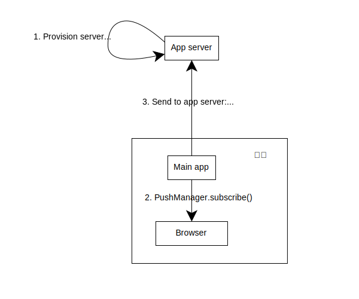
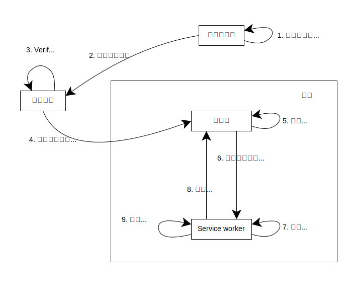

{{PWASidebar}}

通常，网站非常依赖于可靠的网络连接和用户在浏览器中打开的页面。如果没有网络连接，大多数网站就无法使用，如果用户没有在浏览器标签页中打开网站，大多数网站就无法做任何事情。

然而，考虑以下场景：

- 音乐应用程序允许用户在线播放音乐，但可以在后台下载音乐，然后在用户离线时继续播放。
- 用户撰写一封长邮件，按下“发送”，然后失去网络连接。设备在网络再次可用时在后台发送邮件。
- 用户的聊天应用程序收到其中一个联系人的消息，尽管应用程序没有打开，但它在应用程序图标上显示一个标记，让用户知道他们有新的消息。

这些都是用户期待从已安装的应用程序中获得的功能。在这份指南中，我们将介绍一套技术使 PWA 能够：

- 即使设备网络连接不稳定，也能提供良好的用户体验
- 当应用程序未运行时更新其状态
- 通知用户在应用程序未运行时发生的重要事件

本指南介绍的技术包括：

- [service worker API](/zh-CN/docs/Web/API/Service_Worker_API)
- [后台同步 API](/zh-CN/docs/Web/API/Background_Synchronization_API)
- [后台获取 API](/zh-CN/docs/Web/API/Background_Fetch_API)
- [周期性后台同步 API](/zh-CN/docs/Web/API/Web_Periodic_Background_Synchronization_API)
- [推送 API](/zh-CN/docs/Web/API/Push_API)
- [通知 API](/zh-CN/docs/Web/API/Notifications_API)

## 网站和 worker

我们在本指南中讨论的所有技术的基础是 _service worker_。在这一部分，我们将提供一些关于 worker 的背景信息以及它们如何改变 Web 应用程序的架构。

通常，整个网站在一个线程中运行。这包括网站自己的 JavaScript 和所有渲染网站 UI 的工作。这样做的一个结果是，如果你的 JavaScript 运行了一些长时间的操作，网站的主 UI 会被阻塞，网站对用户来说似乎无响应。

[service worker](/zh-CN/docs/Web/API/Service_Worker_API) 是一种特别类型的用来实现 PWA 的 [Web worker](/zh-CN/docs/Web/API/Web_Workers_API)。像所有 web worker 一样，service worker 在与主 JavaScript 代码不同的另一个线程中运行。主代码创建 worker，向 worker 脚本传入 URL。worker 和主代码不能直接访问彼此的状态，但可以通过互发消息来进行通信。worker 可以用于在后台运行计算密集型任务：因为它们在一个单独的线程中运行，所以在应用程序中的主 JavaScript 代码（即实现应用程序 UI 的部分），可以保持对用户的响应。

所以 PWA 总是有一个高级别的架构，可分为：

- _主应用_，包含 HTML、CSS 和实现应用程序 UI 的 JavaScript 部分（例如处理用户事件）
- _service worker_，处理离线和后台任务

在本指南中，当我们展示代码样本时，我们将用像 `// main.js` 或 `// service-worker.js` 这样的注释来指出代码属于应用的哪个部分。

## 离线操作

离线操作允许 PWA 即使在设备没有网络连接时也能提供良好的用户体验。这是通过向应用程序添加 service worker 来实现的。

service worker *控制*应用的部分或全部页面。在安装 service worker 后，它可以从服务器获取它控制的页面的资源（包括页面、样式、脚本和图片等），并将它们添加到本地缓存中。使用 {{domxref("Cache")}} 接口将资源添加到缓存中。在 service worker 全局作用域内，可以通过 {{domxref("WorkerGlobalScope.caches")}} 属性访问 `Cache` 实例。

然后，每当应用程序请求一个资源（例如，因为用户打开了应用程序或点击了内部链接），浏览器在 service worker 的全局作用域内触发一个名为 {{domxref("ServiceWorkerGlobalScope.fetch_event", "fetch")}} 的事件。通过监听此事件，service worker 可以拦截请求。

`fetch` 事件的事件处理器会接收到一个 {{domxref("FetchEvent")}} 对象，该对象：

- 使用 {{domxref("Request")}} 实例提供对请求的访问
- 提供 {{domxref("FetchEvent.respondWith", "respondWith()")}} 方法来响应请求。

service worker 可以采用“缓存优先”策略来处理请求。在这种策略中：

1. 如果请求的资源存在于缓存中，从缓存中获取资源并返回给应用。
2. 如果请求的资源不在缓存中，尝试通过网络获取资源。
   1. 如果能获取到资源，将资源添加到缓存以备下次使用，并返回给应用。
   2. 如果无法获取资源，返回一些默认的备用资源。

以下代码示例显示了对此的一种实现：

```js
// service-worker.js

const putInCache = async (request, response) => {
  const cache = await caches.open("v1");
  await cache.put(request, response);
};

const cacheFirst = async ({ request, fallbackUrl }) => {
  // 首先尝试从缓存中获取资源。
  const responseFromCache = await caches.match(request);
  if (responseFromCache) {
    return responseFromCache;
  }

  // 如果在缓存中找不到响应，则尝试通过网络获取资源。
  try {
    const responseFromNetwork = await fetch(request);
    // 如果网络请求成功，将响应克隆一份：
    // - 将副本放入缓存，供下一次使用
    // - 将原始响应返回给应用程序
    // 需要克隆响应，因为响应只能使用一次。
    putInCache(request, responseFromNetwork.clone());
    return responseFromNetwork;
  } catch (error) {
    // 如果网络请求失败，则从缓存中获取备用响应。
    const fallbackResponse = await caches.match(fallbackUrl);
    if (fallbackResponse) {
      return fallbackResponse;
    }
    // 当连备用响应也不可用时，我们无能为力，
    // 但我们必须返回一个响应对象。
    return new Response("网络错误", {
      status: 408,
      headers: { "Content-Type": "text/plain" },
    });
  }
};

self.addEventListener("fetch", (event) => {
  event.respondWith(
    cacheFirst({
      request: event.request,
      fallbackUrl: "/fallback.html",
    }),
  );
});
```

这意味着在许多情况下，即使网络连接不稳定，Web 应用程序也能正常运行。从主应用程序代码的角度来看，这完全是透明的：应用程序只需发出网络请求并获取响应。此外，由于 service worker 在单独的线程中运行，主应用程序代码可以保持对用户输入的响应，同时获取和缓存资源。

> [!NOTE]
> 这里描述的策略只是 service worker 实现缓存的一种方式。具体来说，在缓存优先策略中，我们先从缓存中查找响应，然后再尝试从网络中获取，这意味着我们更有可能返回一个快速的响应而无需承担网络成本，但也更有可能返回一个过期的响应。
>
> 另一种策略是*网络优先*策略，即首先尝试从服务器获取资源，如果设备离线，则回退到缓存。
>
> 最佳的缓存策略取决于特定的 Web 应用程序及其使用方式。

有关设置 service worker 并使用它们添加离线功能的更多详细信息，请参阅我们的[使用 service worker 指南](/zh-CN/docs/Web/API/Service_Worker_API/Using_Service_Workers)。

## 后台操作

虽然离线操作是 service worker 最常见的用途，但它们也使得 PWA 能够在主应用程序关闭时工作。这是可能的，因为 service worker 可以在主应用程序不运行时运行。

这并不意味着 service worker 始终在运行：浏览器可能会在认为合适的时候停止 service worker。例如，如果 service worker 长时间不活动，它将被停止。但是，当发生需要处理的事件时，浏览器将重新启动 service worker。这使得 PWA 能够以以下方式实现后台操作：

- 在主应用程序中，注册一个请求，要求 service worker 执行某个操作
- 在适当的时机，如果有必要，浏览器将重新启动 service worker，并在 service worker 的作用域中触发一个事件
- service worker 执行操作

在接下来的几节中，我们将讨论一些使用这种模式的功能，它们可以使 PWA 在主应用程序未打开时正常工作。

## 后台同步

假设用户撰写了一封电子邮件并按下“发送”。在传统的网站中，他们必须保持标签页打开，直到应用程序发送了电子邮件：如果他们关闭标签页，或者设备失去连接，那么消息将不会被发送。定义在[后台同步 API](/zh-CN/docs/Web/API/Background_Synchronization_API) 中的后台同步，是 PWA 解决这个问题的方案。

后台同步使应用程序能够请求其 service worker 代表其执行任务。一旦设备有网络连接，浏览器将重新启动 service worker（如果需要），并在 service worker 的作用域内触发名为 [`sync`](/zh-CN/docs/Web/API/ServiceWorkerGlobalScope/sync_event) 的事件。然后 service worker 可以尝试执行任务。如果任务无法完成，那么浏览器可能会通过再次触发事件来重试有限的次数。

### 注册同步事件

要请求 service worker 执行任务，主应用程序可以访问 {{domxref("ServiceWorkerContainer/ready", "navigator.serviceWorker.ready")}}，它会兑现为一个 {{domxref("ServiceWorkerRegistration")}} 对象。然后应用程序在 `ServiceWorkerRegistration` 对象上调用 {{domxref("SyncManager/register", "sync.register()")}}，如下所示：

```js
// main.js

async function registerSync() {
  const swRegistration = await navigator.serviceWorker.ready;
  swRegistration.sync.register("send-message");
}
```

注意应用程序为任务传递了一个名称：在这个示例中是 `"send-message"`。

### 处理同步事件

一旦设备有网络连接，`sync` 事件就会在 service worker 作用域内触发。service worker 检查任务的名称并运行适当的函数，在这个示例中是 `sendMessage()`：

```js
// service-worker.js

self.addEventListener("sync", (event) => {
  if (event.tag == "send-message") {
    event.waitUntil(sendMessage());
  }
});
```

注意我们将 `sendMessage()` 函数的结果传递给事件的 {{domxref("ExtendableEvent/waitUntil", "waitUntil()")}} 方法。`waitUntil()` 方法接受一个 {{jsxref("Promise")}} 作为参数，并要求浏览器不要停止 service worker，直到 promise 已敲定。这也是浏览器知道操作是否成功的方式：如果 promise 被拒绝，那么浏览器可能会通过再次触发 `sync` 事件来重试。

`waitUntil()` 方法是不能保证浏览器不会停止 service worker 的：如果操作花费太长时间，service worker 仍然会被停止。如果发生这种情况，那么操作将被中止，并且下次触发 `sync` 事件时，处理程序将再次从头开始运行——它不会从它停止的地方继续。

“太长时间”是多长是由浏览器决定的。对于 Chrome，如果满足以下条件之一，则可能关闭 service worker：

- 它已经空闲了 30 秒
- 它已经运行同步 JavaScript 30 秒
- 传递给 `waitUntil()` 的 promise 等待敲定的时间超过了 5 分钟

## 后台获取

后台同步对于相对短的后台操作很有用，但正如我们刚刚看到的：如果 service worker 没有在相对短的时间内完成处理同步事件，浏览器将停止 service worker。这是一种有意的措施，通过最小化应用程序在后台时用户的 IP 地址暴露给服务器的时间以节省电池寿命并保护用户的隐私。

这使得后台同步不适合更长的操作（例如下载一部电影）。对于这种场景，你需要[后台获取 API](/zh-CN/docs/Web/API/Background_Fetch_API)。使用后台获取，即使主应用程序 UI 和 service worker 都关闭了，也可以执行网络请求。

使用后台获取：

- 请求是从主应用程序 UI 发起的
- 无论主应用程序是否打开，浏览器都会显示一个持久的 UI 元素，通知用户正在进行的请求，并使他们能够取消它或检查其进度
- 当请求成功或失败，或者用户要求检查请求的进度时，浏览器将启动应用程序的 service worker（如果需要），并在 service worker 的作用域内触发适当的事件。

### 发起后台获取请求

后台获取请求是在主应用程序代码中发起的，通过在 `ServiceWorkerRegistration` 对象上调用 {{domxref("BackgroundFetchManager/fetch", "backgroundFetch.fetch()")}} 完成，如下所示：

```js
// main.js

async function requestBackgroundFetch(movieData) {
  const swRegistration = await navigator.serviceWorker.ready;
  const fetchRegistration = await swRegistration.backgroundFetch.fetch(
    "download-movie",
    ["/my-movie-part-1.webm", "/my-movie-part-2.webm"],
    {
      icons: movieIcons,
      title: "Downloading my movie",
      downloadTotal: 60 * 1024 * 1024,
    },
  );
  //...
}
```

我们传递了三个参数到 `backgroundFetch.fetch()`：

1. 此获取请求的标识符
2. 一个 {{domxref("Request")}} 对象或 URL 的数组。单个后台获取请求可以包括多个网络请求。
3. 包含用于浏览器显示请求存在和进度的 UI 的数据的对象。

`backgroundFetch.fetch()` 调用返回一个兑现为 {{domxref("BackgroundFetchRegistration")}} 对象的 {{jsxref("Promise")}}。这使得主应用程序能够随着请求的进度更新其自己的 UI。但是，如果主应用程序关闭了，获取将在后台继续。

浏览器将显示一个持久的 UI 元素，提醒用户请求正在进行中，让他们有机会了解更多关于请求的信息或者取消它（如果他们希望）。UI 将包括从 `icons` 和 `title` 参数中取得的图标和标题，并使用 `downloadTotal` 作为下载总大小的估计值，以显示请求的进度。

### 处理请求结果

当获取成功或失败，或者用户点击了进度 UI 元素时，浏览器将启动应用程序的 service worker（如果需要），并在 service worker 的范围内触发事件。可以触发以下事件：

- `backgroundfetchsuccess`：所有请求都成功
- `backgroundfetchfail`：至少有一个请求失败
- `backgroundfetchabort`：获取被用户或主应用程序取消
- `backgroundfetchclick`：用户点击了浏览器显示的进度 UI 元素

#### 获取响应数据

在 `backgroundfetchsuccess`、`backgroundfetchfail` 和 `backgroundfetchabort` 事件的处理器中，service worker 可以获取请求和响应的数据。

可以在事件处理器中访问事件的 {{domxref("BackgroundFetchEvent/registration", "registration")}} 属性以获取响应。这是一个 {{domxref("BackgroundFetchRegistration")}} 对象，它有 {{domxref("BackgroundFetchRegistration/matchAll", "matchAll()")}} 和 {{domxref("BackgroundFetchRegistration/match", "match()")}} 方法，它们返回与给定 URL 匹配的 {{domxref("BackgroundFetchRecord")}} 对象（或者，在 `matchAll()` 的情况下，如果没有给定 URL，则返回所有记录）。

每个 `BackgroundFetchRecord` 都有一个 {{domxref("BackgroundFetchRecord/responseReady", "responseReady")}} 属性，它是一个 `Promise`，一旦响应可用，就会兑现 {{domxref("Response")}}。

所以要访问响应数据，处理器可以做类似这样的事情：

```js
// service-worker.js

self.addEventListener("backgroundfetchsuccess", (event) => {
  const registration = event.registration;

  event.waitUntil(async () => {
    const registration = event.registration;
    const records = await registration.matchAll();
    const responsePromises = records.map(
      async (record) => await record.responseReady,
    );

    const responses = Promise.all(responsePromises);
    // 使用响应数据做一些事情
  });
});
```

由于响应数据在处理器退出后不会可用，所以如果应用程序仍然需要它，处理程序应该存储数据（例如，在 {{domxref("Cache")}} 中）。

#### 更新浏览器的 UI

传递给 `backgroundfetchsuccess` 和 `backgroundfetchfail` 的事件对象也有一个 {{domxref("BackgroundFetchUpdateUIEvent/updateUI", "updateUI()")}} 方法，它可以用来更新浏览器显示的 UI，以便让用户了解获取操作的情况。使用 `updateUI()`，处理器可以更新 UI 元素的标题和图标：

```js
// service-worker.js

self.addEventListener("backgroundfetchsuccess", (event) => {
  // 获取并存储响应数据
  // ...

  event.updateUI({ title: "完成了你的下载！" });
});

self.addEventListener("backgroundfetchfail", (event) => {
  event.updateUI({ title: "无法完成下载" });
});
```

#### 响应用户交互

当用户点击浏览器在获取期间显示的 UI 元素时，会触发 `backgroundfetchclick` 事件。

这里的预期响应是打开一个窗口，向用户提供有关获取操作的更多信息，这可以通过在 service worker 中使用 {{domxref("Clients/openWindow", "clients.openWindow()")}} 来完成。例如：

```js
// service-worker.js

self.addEventListener("backgroundfetchclick", (event) => {
  const registration = event.registration;

  if (registration.result === "success") {
    clients.openWindow("/play-movie");
  } else {
    clients.openWindow("/movie-download-progress");
  }
});
```

## 周期性后台同步

[周期性后台同步 API](/zh-CN/docs/Web/API/Web_Periodic_Background_Synchronization_API) 使得 PWA 能够在主应用程序处于关闭状态的同时，在后台周期性地更新其数据。

这可以极大地改善 PWA 提供的离线体验。考虑一个依赖于相当新鲜内容的应用程序，比如新闻应用程序。如果设备在用户打开应用程序时离线，则即使使用基于 service worker 的缓存，文章也只会和上次打开应用程序时一样。通过周期性后台同步，应用程序可以在设备联网时在后台刷新其内容，因此能够向用户显示相对较新鲜的内容。

这利用了一个事实（特别是对于移动设备），即网络连接的好坏是*间歇性*的：通过利用设备具有网络连接的时段，应用程序可以消除连接间隙。

### 注册周期性同步事件

注册周期性同步事件的代码遵循与[注册同步事件](#注册同步事件)相同的模式。{{domxref("ServiceWorkerRegistration")}} 有一个 {{domxref("ServiceWorkerRegistration.periodicSync", "periodicSync")}} 属性，它有一个 {{domxref("PeriodicSyncManager/register", "register()")}} 方法，以周期性同步的名称作为参数。

但是，`periodicSync.register()` 需要一个额外的参数，它是一个带有 `minInterval` 属性的对象。这表示同步尝试之间的最小间隔，以毫秒为单位：

```js
// main.js

async function registerPeriodicSync() {
  const swRegistration = await navigator.serviceWorker.ready;
  swRegistration.periodicSync.register("update-news", {
    // 尝试每 24 小时更新一次
    minInterval: 24 * 60 * 60 * 1000,
  });
}
```

### 处理周期性同步事件

尽管 PWA 在 `register()` 调用中请求特定间隔，但由浏览器决定周期性同步事件的生成频率。用户经常打开和交互的应用程序将更有可能收到周期性同步事件，并且会收到更频繁的事件，而用户很少或根本不与之交互的应用程序则不然。

当浏览器决定生成周期性同步事件时，模式如下：它启动 service worker（如果需要），并在 service worker 的全局作用域中触发 {{domxref("ServiceWorkerGlobalScope.periodicsync_event", "periodicSync")}} 事件。

service worker 的事件处理程序检查事件的名称，并在事件的 {{domxref("ExtendableEvent/waitUntil", "waitUntil()")}} 方法内调用适当的函数：

```js
// service-worker.js

self.addEventListener("periodicsync", (event) => {
  if (event.tag === "update-news") {
    event.waitUntil(updateNews());
  }
});
```

在 `updateNews()` 内部，service worker 可以获取和缓存最新的文章。`updateNews()` 函数应该相对快速地完成：如果 service worker 花费太长时间来更新其内容，浏览器将停止它。

### 注销周期性同步

当 PWA 不再需要后台周期性更新时（例如，因为用户在应用程序设置中关闭了它们），PWA 应该要求浏览器停止生成周期性同步事件，方法是调用 {{domxref("serviceWorkerRegistration.periodicSync", "periodicSync")}} 的 {{domxref("PeriodicSyncManager/unregister", "unregister()")}} 方法：

```js
// main.js

async function registerPeriodicSync() {
  const swRegistration = await navigator.serviceWorker.ready;
  swRegistration.periodicSync.unregister("update-news");
}
```

## 推送消息

[推送 API](/zh-CN/docs/Web/API/Push_API) 使 PWA 能够接收从服务器推送的消息，无论应用程序是否正在运行。当设备接收到消息时，应用程序的 service worker 将启动并处理消息，并向用户显示[通知](/zh-CN/docs/Web/API/Notifications_API)。规范允许“静默推送”，在这种情况下不显示通知，但由于隐私问题（例如，推送随后可用于跟踪用户的位置），没有浏览器支持这一点。

向用户显示通知会分散他们的注意力，并可能非常恼人，因此请谨慎使用推送消息。通常，当你需要提醒用户某些事情，并且不能等待他们下次打开你的应用程序时，它们才适合。

推送通知的一个常见用例是聊天应用：当用户从其联系人之一收到消息时，它会以推送消息的形式交付，并且该应用程序会显示通知。

推送消息不是直接从应用服务器发送到设备的。相反，你的应用服务器将消息发送到推送服务，然后设备可以从中检索它们并将它们交付给应用程序。

这也意味着你的服务器向推送服务发送的消息需要被{{Glossary("Encryption", "加密")}}（这样推送服务无法读取它们）和{{Glossary("Signature/Security", "签名")}}（这样推送服务知道消息确实来自你的服务器，而不是某人伪装你的服务器）。

推送服务由浏览器供应商或第三方操作，应用服务器使用 [HTTP 推送](https://datatracker.ietf.org/doc/html/rfc8030)协议与其通信。应用服务器可以使用第三方库（如 [web-push](https://github.com/web-push-libs/web-push)）来处理协议详细信息。

### 订阅推送消息

订阅推送消息的模式如下所示：



1. 作为先决条件，应用服务器需要使用{{Glossary("Public-key_cryptography", "公钥/私钥对")}}来设置，以便它可以签名推送消息。签名消息需要遵循 [VAPID](https://datatracker.ietf.org/doc/html/draft-thomson-webpush-vapid-02) 规范。

2. 在设备上，应用程序使用 {{domxref("PushManager.subscribe()")}} 方法订阅来自服务器的消息。`subscribe()` 方法：

   - 将应用服务器的公钥作为参数：推送服务将用此来验证来自应用服务器的消息签名。

   - 返回一个会兑现为一个 {{domxref("PushSubscription")}} 对象的 `Promise`。这个对象包括：

     - 推送服务的[端点](/zh-CN/docs/Web/API/PushSubscription/endpoint): 这是应用服务器了解在何处发送推送消息的方式。
     - 你的服务器将用来加密发向推送服务的消息的[公开加密密钥](/zh-CN/docs/Web/API/PushSubscription/getKey)。

3. 应用程序将端点和公开加密密钥发送到你的服务器（例如，使用 {{domxref("fetch()")}}）。

在此之后，应用服务器就可以开始发送推送消息了。

### 发送、交付和处理推送消息

当服务器上发生应用程序要处理的事件时，服务器可以发送消息，步骤如下所示：



1. 应用服务器使用其私有签名密钥对消息进行签名，并使用推送服务的公开加密密钥对消息进行加密。应用服务器可以使用诸如 [web-push](https://github.com/web-push-libs/web-push) 之类的库来简化此操作。
2. 应用服务器使用 [HTTP 推送](https://datatracker.ietf.org/doc/html/rfc8030)协议将消息发送到推送服务的端点，再次可以选择使用诸如 web-push 之类的库。
3. 推送服务检查消息上的签名，如果签名有效，推送服务将消息排队以便交付。
4. 当设备有网络连接时，推送服务会将加密消息交付到浏览器。
5. 当浏览器接收到加密消息时，它会解密消息。
6. 浏览器会启动 service worker（如果需要）, 并在 service worker 的全局作用域中触发一个名为 {{domxref("ServiceWorkerGlobalScope.push_event", "push")}} 的事件。事件处理程序被传递一个 {{domxref("PushEvent")}} 对象，其中包含消息数据。
7. 在其事件处理程序中，service worker 执行对消息的任何处理。如往常一样，事件处理程序调用 `event.waitUntil()` 来要求浏览器使 service worker 继续运行。
8. 在其事件处理程序中，service worker 使用 {{domxref("ServiceWorkerRegistration/showNotification", "registration.showNotification()")}} 创建一个通知。
9. 如果用户点击通知或关闭它，会分别在 service worker 的全局作用域中触发 {{domxref("ServiceWorkerGlobalScope.notificationclick_event", "notificationclick")}} 和 {{domxref("ServiceWorkerGlobalScope.notificationclose_event", "notificationclose")}} 事件。这使应用程序能够处理用户对通知的响应。

## 权限和限制

浏览器必须在为 Web 开发者提供强大 API 的同时保护用户免受恶意、剥削性或编写低劣的网站的侵害。他们提供的主要保护措施之一是用户可以关闭网站的页面，然后它就不再活跃在他们的设备上了。本文描述的 API 倾向于违反这一保证，因此浏览器必须采取额外步骤来帮助确保用户意识到这一点，并且这些 API 是以符合用户利益的方式使用的。

在本节中，我们将概述这些步骤。其中几个 API 需要显式[用户权限](/zh-CN/docs/Web/API/Permissions_API)，以及各种其他限制和设计选择，以帮助保护用户。

- 后台同步 API 不需要显式用户权限，但是只有在主应用程序打开时才能发出后台同步请求，并且浏览器会限制重试次数和后台同步操作可以花费的时间长度。

- 后台获取 API 需要 `"background-fetch"` 用户权限，浏览器会显示正在进行的获取操作的进度，允许用户取消它。

- 周期性后台同步 API 需要 `"periodic-background-sync"` 用户权限，浏览器应当允许用户完全禁用周期性后台同步。此外，浏览器可能会将同步事件的频率与用户选择与应用程序交互的范围联系在一起：因此，用户很少使用的应用程序可能会收到很少的事件（甚至根本不会收到事件）。

- 推送 API 需要 `"push"` 用户权限，所有浏览器都需要推送事件对用户可见，这意味着它们会生成用户可见通知。

## 参见

### 参考

- [Service Worker API](/zh-CN/docs/Web/API/Service_Worker_API)
- [后台同步 API](/zh-CN/docs/Web/API/Background_Synchronization_API)
- [后台获取 API](/zh-CN/docs/Web/API/Background_Fetch_API)
- [周期性后台同步 API](/zh-CN/docs/Web/API/Web_Periodic_Background_Synchronization_API)
- [推送 API](/zh-CN/docs/Web/API/Push_API)
- [通知 API](/zh-CN/docs/Web/API/Notifications_API)

### 指南

- web.dev 上的[介绍后台同步](https://developer.chrome.com/blog/background-sync/)（2017）
- web.dev 上的[介绍后台获取](https://developer.chrome.com/blog/background-fetch/)（2022）
- web.dev 上的[周期性后台同步 API](https://developer.chrome.com/articles/periodic-background-sync/)（2020）
- web.dev 上的[通知](https://web.dev/explore/notifications)
- web.dev 上的[具有离线流媒体的 PWA](https://web.dev/articles/pwa-with-offline-streaming)（2021）
